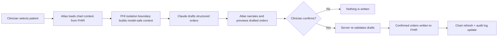
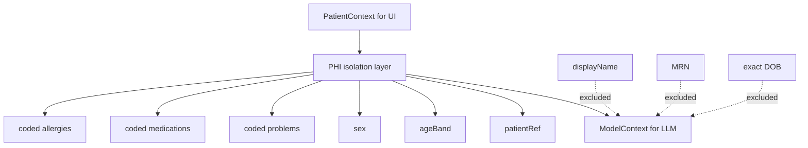
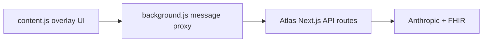

# Atlas — EHR Copilot

> Say it. Confirm it. Done.

Atlas is a **security-conscious EHR copilot prototype** that turns a clinician’s plain-English intent into **structured, coded FHIR orders** with a strict **confirm-before-write** workflow and a deliberate **PHI-isolation boundary**.

Built as a hackathon MVP, Atlas demonstrates a narrow but powerful loop:

1. read synthetic patient context from FHIR
2. isolate model-safe coded context
3. draft structured orders from natural language
4. narrate exactly what will happen
5. require explicit clinician confirmation
6. write confirmed orders back to FHIR

This repository contains both the **working product prototype** and the **full product strategy + planning package** behind it.

---

## Table of contents

- [What Atlas is](#what-atlas-is)
- [Why this repo matters](#why-this-repo-matters)
- [Core workflow](#core-workflow)
- [Architecture at a glance](#architecture-at-a-glance)
- [Security and safety model](#security-and-safety-model)
- [Repository map](#repository-map)
- [Current implementation status](#current-implementation-status)
- [What is real vs mocked](#what-is-real-vs-mocked)
- [Local setup](#local-setup)
- [Environment variables](#environment-variables)
- [Scripts](#scripts)
- [Chrome extension overlay](#chrome-extension-overlay)
- [Documentation map](#documentation-map)
- [Known limits](#known-limits)
- [Suggested next steps](#suggested-next-steps)

---

## What Atlas is

Atlas is a browser-based copilot for clinical order entry.

Instead of forcing a clinician through nested EHR menus, Atlas lets them type something like:

> `order a CBC and a chest X-ray, and start metformin 500mg BID`

Atlas then:
- reads the selected patient’s chart context from FHIR
- sends only a **PHI-stripped, coded model context** to Claude
- drafts structured `ServiceRequest` and `MedicationRequest` resources
- presents a plain-English summary and coded details
- blocks any write until the clinician explicitly confirms
- writes confirmed orders back to FHIR

### Product thesis

The core thesis of the product is simple:

**Clinicians already know what they want. The bottleneck is forcing that intent through slow EHR UI.**

Atlas reduces that bottleneck while keeping trust central:
- no silent action
- no raw PHI to the model
- no guessed medication doses
- no arbitrary client-side writes

---

## Why this repo matters

This repository is more than a demo app.

It combines:

### 1. A working prototype
A Next.js application with a floating Atlas sidecar, patient selection, order drafting, confirmation, audit logging, and FHIR write-back.

### 2. A safety architecture
The repo explicitly separates:
- **display context** for the clinician
- **model context** for the LLM

That separation is one of the most important design decisions in the project.

### 3. A complete planning system
The repo includes:
- product idea
- product vision
- PRD
- roadmap
- demo script

That makes this repository useful not only for development, but for:
- judges
- collaborators
- future contributors
- design reviews
- investor/advisor conversations

---

## Core workflow



### Magic moment

The central demo moment is:

**Pick a patient → enter a natural-language order set → review structured drafts → confirm once → watch the orders appear in the chart**

That is the wedge this MVP is optimized around.

---

## Architecture at a glance

```mermaid
flowchart LR
  subgraph Browser[Browser / UI]
    UI[Workspace + floating Atlas panel]
    EXT[Optional Chrome extension overlay]
  end

  subgraph Server[Next.js server routes]
    PAT[/api/patient]
    PATS[/api/patients]
    DRAFT[/api/draft]
    ORDERS[/api/orders]
    AUDIT[/api/audit]
    ISO[PHI isolation layer]
    AGENT[Drafting agent]
    VALIDATE[Server-side validation]
  end

  subgraph External[External systems]
    FHIR[HAPI FHIR sandbox or local mock FHIR]
    LLM[Anthropic Claude API]
  end

  UI --> PAT
  UI --> PATS
  UI --> DRAFT
  UI --> ORDERS
  UI --> AUDIT
  PAT --> FHIR
  PATS --> FHIR
  DRAFT --> ISO
  ISO --> AGENT
  AGENT --> LLM
  ORDERS --> VALIDATE
  VALIDATE --> FHIR
  EXT --> UI
```

### Architectural intent

Atlas is built so that the browser is responsible for:
- collecting user input
- rendering chart context
- showing draft previews
- handling confirmation UX

The server is responsible for:
- secrets
- model calls
- FHIR reads and writes
- PHI isolation
- draft validation
- write safety

That is the right trust boundary for this type of product.

---

## Security and safety model

Security is not just a section in this project — it is part of the repo structure.

### Safety principles

- **Confirm-before-write**: nothing reaches the chart without explicit approval.
- **PHI isolation**: the model gets coded metadata, not raw patient identifiers.
- **Server-side control**: Anthropic and FHIR write operations happen on the server.
- **No guessed doses**: ambiguity produces a clarifying question, not an assumption.
- **Re-validation before write**: drafts are re-checked server-side before being posted.

### PHI isolation boundary

The PHI boundary is implemented in `src/lib/phi/isolate.ts`.

It builds the only object that may be sent to the model.

Included in model context:
- opaque patient reference
- banded age
- sex
- coded problems
- coded medications
- coded allergies

Excluded from model context:
- display name
- MRN
- exact DOB
- free-text identifiers



### Write safety

Before a confirmed order is posted:
- the server validates the payload shape
- the draft must match a known confirmable shape
- the code must align with the curated vocabulary
- the final resource is built server-side

The client does **not** get to post arbitrary FHIR resources directly.

### Reliability fallback

The public HAPI FHIR sandbox is shared and can be flaky.

To protect the demo path, Atlas supports:
- `NEXT_PUBLIC_USE_MOCK_FHIR=true`
- an in-process mock FHIR server
- local in-memory writes for demo continuity

### Important note

Atlas is **not** a production-certified healthcare system.

This repo demonstrates a strong trust model for an MVP, but it is still a:
- hackathon prototype
- synthetic-data system
- product proof-of-concept

---

## Repository map

```text
atlas-ehr-copilot/
├── README.md
├── product-idea.md
├── vision.json
├── docs/
│   ├── demo-script.md
│   ├── prd.md
│   ├── product-roadmap.md
│   ├── product-vision.md
│   ├── repository-guide.md
│   ├── project-status.md
│   └── implementation-plan.md
├── extension/
│   ├── README.md
│   ├── background.js
│   ├── content.js
│   └── manifest.json
├── src/
│   ├── app/
│   │   ├── api/
│   │   ├── login/
│   │   ├── welcome/
│   │   ├── globals.css
│   │   ├── layout.tsx
│   │   └── page.tsx
│   ├── components/
│   │   ├── features/
│   │   └── ui/
│   ├── lib/
│   │   ├── agent/
│   │   ├── audit/
│   │   ├── codes/
│   │   ├── fhir/
│   │   ├── hooks/
│   │   ├── phi/
│   │   └── ...
│   └── mock/
└── package.json
```

### Folder responsibilities

#### `src/app/`
App routes, layout, global styles, and server route handlers.

#### `src/app/api/`
Server-side endpoints for:
- patient context
- patient list
- drafting
- order submission
- audit log

#### `src/components/ui/`
Design-system primitives such as buttons, cards, badges, inputs, and skeletons.

#### `src/components/features/`
Atlas-specific product features such as:
- workspace shell
- chart display
- floating sidecar
- order entry panel
- confirm UI
- audit log

#### `src/lib/agent/`
Anthropic integration, prompt construction, and tool-driven structured drafting.

#### `src/lib/fhir/`
FHIR read and write helpers, typed wrappers, and resource construction.

#### `src/lib/phi/`
The trust-critical privacy boundary for model context.

#### `src/lib/codes/`
Curated order vocabulary used to constrain the MVP’s draftable order set.

#### `src/lib/audit/`
In-memory audit log used to show draft/confirm/reject/failure events.

#### `src/mock/`
Demo-safe local FHIR fallback.

#### `extension/`
Chrome extension that overlays Atlas on top of third-party EHR pages.

---

## Current implementation status

Based on the roadmap and repository contents, this repo is in a **build-complete hackathon MVP state**.

### Implemented

- Next.js 16 App Router app
- clinical sidecar UX
- floating Atlas panel
- mocked SMART-style login
- synthetic patient selection
- live FHIR chart reads
- natural-language draft flow
- structured tool-based Claude output
- PHI isolation boundary
- server-side draft validation
- FHIR write-back
- in-memory audit logging
- mock FHIR fallback
- extension overlay
- demo script and product planning docs

### Strongest implemented product ideas

- trust-first confirmation model
- explicit privacy boundary
- constrained drafting vocabulary
- real-vs-mock reliability strategy
- docs that explain not just the app, but the product logic

---

## What is real vs mocked

This is one of the most important distinctions in the project.

| Capability | Status |
|---|---|
| Next.js product prototype | Real |
| Claude-based order drafting | Real |
| FHIR patient reads | Real |
| FHIR order writes | Real against sandbox |
| PHI-isolation boundary | Real |
| Audit log | Real, but in-memory only |
| SMART-on-FHIR login | Mocked |
| Production auth / identity | Not implemented |
| Persistent audit database | Not implemented |
| Real PHI usage | Explicitly not used |
| Demo fallback FHIR server | Real local mock |

### Plain-language version

**Real enough to demonstrate the workflow. Not production-ready enough to deploy into clinical practice.**

---

## Local setup

### Requirements

- Node.js compatible with Next.js 16
- npm
- Anthropic API key for live drafting

### Install and run

```bash
npm install
cp .env.example .env.local
npm run dev
```

Open:

```text
http://localhost:3000
```

### Recommended demo flow

1. set `ANTHROPIC_API_KEY` in `.env.local`
2. leave `FHIR_BASE_URL` pointed at HAPI for realism
3. if sandbox stability is a concern, set `NEXT_PUBLIC_USE_MOCK_FHIR=true`
4. restart the app after env changes

---

## Environment variables

| Variable | Purpose |
|---|---|
| `ANTHROPIC_API_KEY` | Required for Claude-based drafting |
| `ANTHROPIC_MODEL` | Model selection for structured order drafting |
| `FHIR_BASE_URL` | Base URL for the FHIR server |
| `DEMO_PATIENT_ID` | Pinned demo patient for the default scenario |
| `NEXT_PUBLIC_USE_MOCK_FHIR` | Enables local mock FHIR fallback |

### Example

```bash
ANTHROPIC_API_KEY=sk-ant-...
ANTHROPIC_MODEL=claude-sonnet-4-6
FHIR_BASE_URL=https://hapi.fhir.org/baseR4
DEMO_PATIENT_ID=123836453
NEXT_PUBLIC_USE_MOCK_FHIR=false
```

---

## Scripts

```bash
npm run dev
npm run build
npm run start
npm run lint
npm test
```

### Notes

- `npm test` includes the PHI-isolation safety test.
- the draft success-rate test may hit the live model depending on how it is run
- this project is optimized for local-first demo use

---

## Chrome extension overlay

The repo includes a Chrome extension in `extension/`.

Its purpose is to make Atlas feel like it is running **inside the EHR**, not beside it in a separate tab.

### Extension architecture



### Why the extension exists

A normal web app cannot render directly on top of another origin’s DOM.

The extension solves that by injecting a floating Atlas panel over pages like:
- Epic sandbox
- OpenEMR
- other web-based EHR environments

This is important for demo realism and future workflow fit.

See:
- `extension/README.md`

---

## Documentation map

If you only read one file first, read this README.

After that:

### Product and strategy
- `product-idea.md` — original concept framing
- `docs/product-vision.md` — mission, personas, strategy, branding, design direction
- `vision.json` — structured vision snapshot

### Product requirements and execution
- `docs/prd.md` — detailed technical + product requirements
- `docs/product-roadmap.md` — phased implementation roadmap
- `docs/demo-script.md` — rehearsed demo narrative

### Repository onboarding and status
- `docs/repository-guide.md` — full repo walkthrough
- `docs/project-status.md` — current state, readiness, strengths, limits
- `docs/implementation-plan.md` — recommended next-phase plan

---

## Known limits

Atlas is intentionally narrow.

### Product limits
- curated order vocabulary, not universal order coverage
- optimized for a single compelling demo flow
- no production auth
- no persistent audit store
- no real EHR vendor launch integration
- no clinical decision support engine
- no enterprise access controls or tenancy model

### Technical limits
- public FHIR sandbox may be unstable
- in-memory audit log is not durable
- mock fallback prioritizes demo continuity over production realism
- extension integration is overlay-based, not a real SMART launch

### Compliance limits
- strong privacy design principles are present
- production compliance, governance, legal review, and deployment controls are not yet implemented

---

## Suggested next steps

### Phase A — Documentation and demo hardening
- polish contributor onboarding
- make real-vs-mock behavior explicit everywhere
- document known failure modes and recovery paths
- add architecture and trust diagrams to supporting docs

### Phase B — Product hardening
- expand automated test coverage
- strengthen observability and error reporting
- persist audit records
- measure real latency and success-rate baselines
- formalize validation coverage for order drafting

### Phase C — Pilot readiness
- implement real SMART-on-FHIR auth
- introduce durable audit storage
- define deployment and environment separation
- add operational logging and monitoring
- prepare a clinical safety review workflow

### Phase D — Production path
- enterprise auth and access control
- stronger compliance posture
- multi-tenant design
- vendor integration strategy
- governance for vocabulary, prompts, and release safety

---

## Bottom line

Atlas is a **thoughtful, well-scoped, trust-first healthcare AI prototype**.

Its most important idea is not just that it can draft orders.
Its most important idea is that it tries to do so with:
- a visible human confirmation step
- a constrained structured output path
- a deliberate boundary between patient display data and model input

That makes this repository a strong foundation for:
- hackathon demos
- product storytelling
- technical exploration
- future pilot planning

If you are evaluating the repo quickly, the shortest summary is:

> **Atlas is a FHIR-native, confirm-before-write EHR copilot prototype with a serious trust model and unusually complete product documentation for its stage.**
